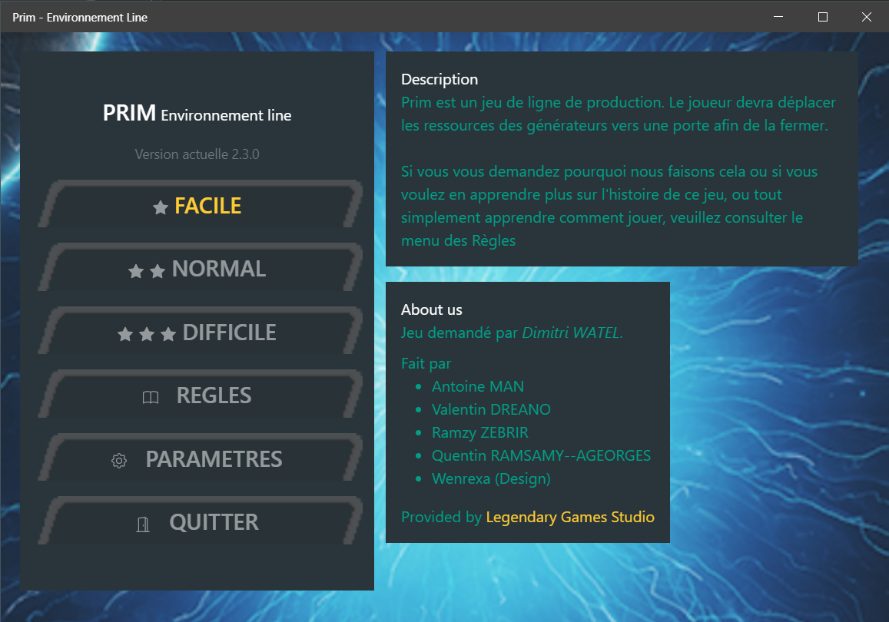
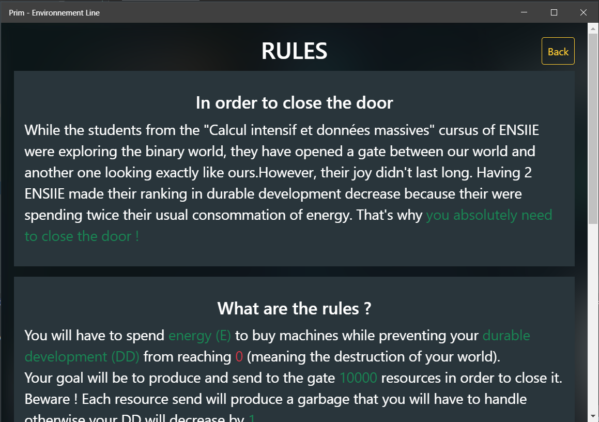
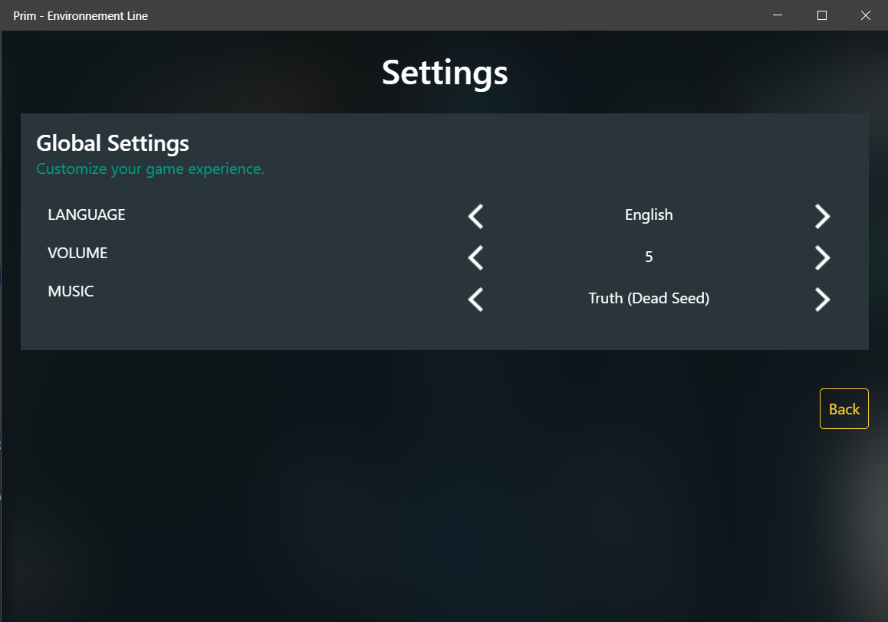
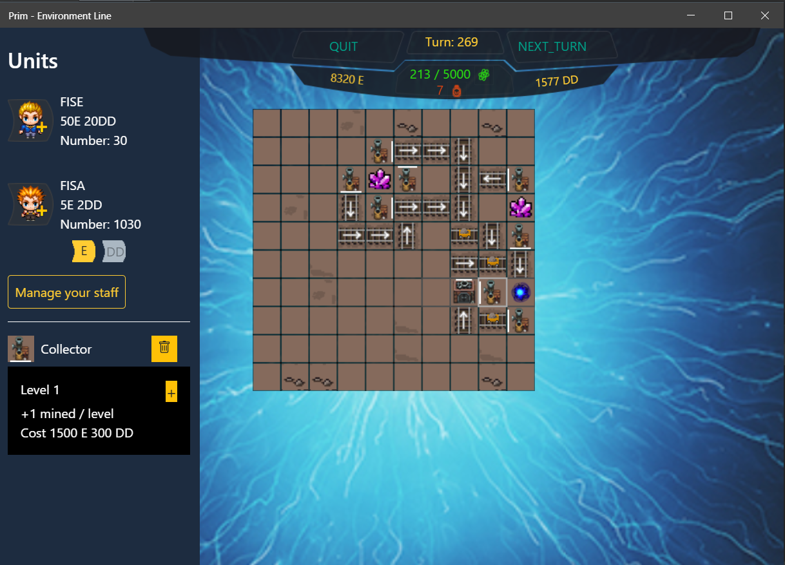
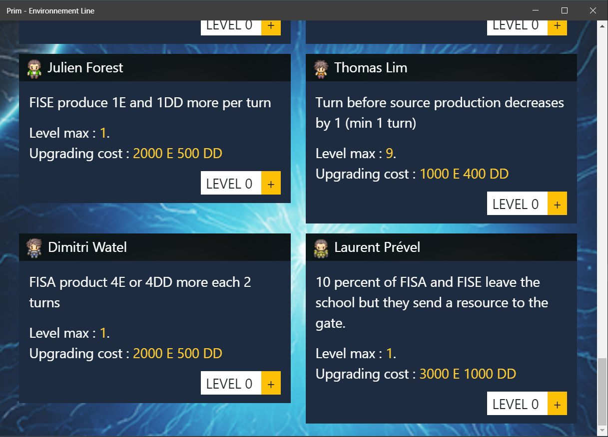
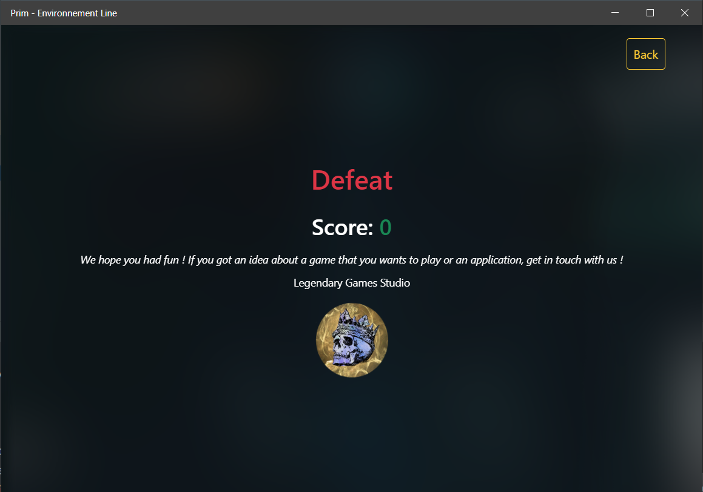

# Prim

An original game made by Legendary Games studio, requested by [Dimitri Watel](http://dimitri.watel.free.fr/). There is a version in C using ncurses, and we have a version made using electron. It was coded by

* Valentin DREANO
* Antoine MAN
* Quentin RAMSAMY- -AGEORGES
* Ramzy ZEBRIR

## Why you should play this game ?

Well this is quite a simple game, you might want to try to challenge yourself and get the highest score, or simply check the code and find how you could customize the game to make it yours, since the game is open-source.

## Screenshots

